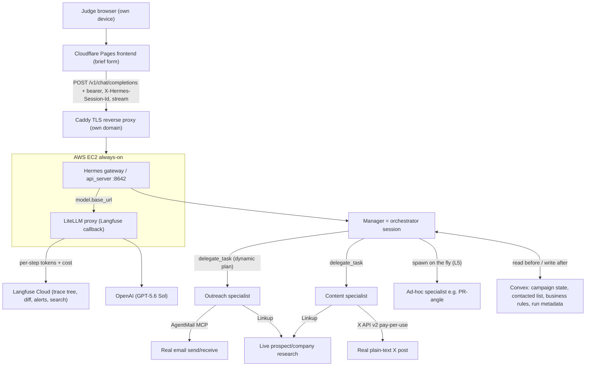
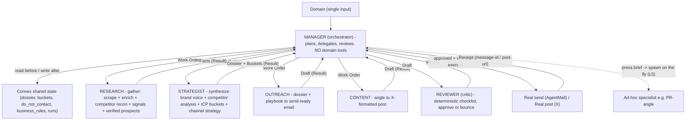

# GTM Agency on Hermes — Build Plan (AI as Agency)

A multi-agent GTM agency on Hermes: a planner **Manager** that dynamically decomposes a request and delegates to single-responsibility specialists (**Research, Strategist, Outreach, Content**) with a pinned **Reviewer**/critic, executing real actions on real live surfaces (AgentMail email, X posts) through explicit typed handoffs, instrumented for production-grade observability and a closed-loop eval, deployed to a judge-accessible URL. Engineered to hit L5 on every AI-as-Agency parameter.

Source of truth in-repo: [AGENTS.md](AGENTS.md), strategy report [references/research-context.md](references/research-context.md), harness setup [references/hermes-setup-guide.md](references/hermes-setup-guide.md), brand/design system [DESIGN.md](DESIGN.md), tactical playbook source [references/okara-virality-playbooks.md](references/okara-virality-playbooks.md).

## Build checklist

- [ ] **provisioning** (HUMAN, parallel) — keys/accounts per the Provisioning checklist (P0: AgentMail, Convex, AWS EC2+domain; P1: Langfuse, Linkup, Exa, Apollo OAuth, X API write+$5; P2: ElevenLabs, Reoon/Hunter, Wispr)
- [ ] **schemas** — lock typed handoff contracts + Convex tables (the spec Fable one-shots against)
- [ ] **fable-baseline** — Fable/Claude Code one-shots the scaffold (types, skill files, agent prompts, Convex schema, domain-first + dossier UI per DESIGN.md, LiteLLM+Langfuse stubs)
- [ ] **infra** — AWS EC2 + Hermes gateway/api_server on :8642, domain via Route53, Caddy TLS, verify remote streaming `/v1/chat/completions`
- [ ] **litellm-obs** — LiteLLM proxy (Langfuse callback) in front of OpenAI; Hermes `model.base_url` at it; per-step token+cost + trace tree in Langfuse
- [ ] **manager-planner** — Manager (orchestrator, no domain tools): classify → typed plan → delegate → review loop → guarded execute → replan/escalate
- [ ] **research-agent** — gather: Mode A onboarding recon + Mode B per-bucket prospecting; wire Linkup+Exa+Apollo/Clay+Firecrawl+verify MCPs
- [ ] **strategist-agent** — synthesize: Facts → Dossier + Origami-style ICP buckets + Opportunities feed (no domain tools)
- [ ] **outreach-agent** — Dossier + playbook → draft → self-check → send only after Reviewer + verify; wire AgentMail (+ Cal.com)
- [ ] **content-agent** — state object → angle tree → scored hooks → self-eval → guardrails → real X post
- [ ] **reviewer-agent** — deterministic per-type checklist; approve or bounce with required_fixes
- [ ] **playbooks** — write playbooks + rubrics as versioned SKILL.md files
- [ ] **memory-convex** — three-layer memory (now + user past + business rules) injected into each Work Order
- [ ] **obs-l5** — Langfuse Experiments run-diff, a Monitor alert that fires, cross-run search
- [ ] **eval-loop** — evals/briefs.yaml + promptfoo CI gate blocking a regression; auto-append failed runs; version prompts
- [ ] **frontend** — domain-first onboarding → streaming trace → papercraft Campaign Dossier per DESIGN.md on Cloudflare Pages
- [ ] **mgmt-ui** — non-eng defines a new agent role (job, tools, guardrails) that writes a SKILL.md; stranger test <10 min
- [ ] **elevenlabs** — voice briefing reads the plan/dossier aloud
- [ ] **proof-demo** — 3+ real tasks for overflow; rehearse 4-min demo; backup recording; pre-demo smoke test

## North star and track

**Track:** AI as Agency (164 base + uncapped overflow). **Root parameter (20x): working product shipping real output on real live surfaces.** North star: automate the highest-agency GTM services — start with a fully-autonomous **outreach engine** (sends real email), add a **content specialist** (posts real X), orchestrated by a **manager that genuinely plans and delegates**. Everything optimized to hit L5 on all seven parameters and farm real-output overflow (+20 pts per extra autonomous real task at judging).

## Product experience: best of Origami + Okara, our own execution wedge

**How Origami works (reference):** domain in -> a ranked list of hyper-specific, signal-based **ICP buckets**, each with (a) where they live + the trigger signal ("Reddit users in r/webdev who posted about hiding YouTube Shorts in the last 60 days"), (b) an estimated size ("180 companies"), (c) a tailored outreach angle ("reference their post, offer a permanent fix"). This is precise, reachable segmentation, not "mid-market SaaS."

**How Okara works (reference):** URL in -> auto-built Company context (Product Info, Brand Voice, Competitor Analysis, Marketing Strategy, llms.txt) + an Analytics panel + an **Agents Feed** where per-channel agents (X, Reddit, SEO, Articles, HN, LinkedIn, Influencer, UGC) each surface "N opportunities ready" for human approval. It stops at drafts + approve.

**Our synthesis (and wedge):**
- From Origami: domain -> signal-based ICP buckets (size + where + angle) as the onboarding aha.
- From Okara: auto-derived brand/competitor/strategy dossier + an opportunities feed + "talk to your CMO" chat.
- **Wedge (the 20x lever): we actually execute on real surfaces** — a planner Manager that delegates, reviews, and fires the real send/post with a logged receipt. Okara "helps you write faster"; we run the play end to end.

**Onboarding = one field.** The primary CTA on open is a single domain input (`yourcompany.com`) with one Hanko Red "seal" button (per [DESIGN.md](DESIGN.md)). No signup wall before the aha. On submit, the agent trace streams live (Space Mono "agent trace" styling) as the dossier is "folded" into being, then renders as a vertical, papercraft **Campaign Dossier**.

## Core feature loops (build these to be able to test)

- **Loop 0 - Onboarding / Intelligence (domain -> Dossier). The aha.** Manager dispatches Research (gather) + Strategist (synthesize): brand tone/voice, positioning, competitor reverse-engineering (top pages, top posts, ads library, backlinks, community sentiment - straight from the okara playbook), and the hero output: **Origami-style ICP buckets** (platform + community + dated trigger + size estimate + angle). Testable: real domain -> real dossier with real competitor + bucket data.
- **Loop 1 - Strategy (Dossier -> Opportunities feed).** Strategist turns the dossier into a channel plan and a feed of concrete, approvable opportunities (e.g. "cold-email these 180 r/webdev users", "post this launch tweet", "reply to these 3 threads"), each tagged with the playbook it will use.
- **Loop 2 - Outreach execution (bucket -> real email). Highest agency.** Research pulls real verified prospects in a bucket -> Outreach drafts via playbook -> Reviewer -> verify -> **real AgentMail send** -> logged receipt.
- **Loop 3 - Content execution (angle -> real X post).** Content: angle tree -> hook scoring -> self-eval -> **real X post** -> logged receipt.
- **Loop 4 - Observe + iterate.** Trace tree + per-step cost, run diff, eval loop.

Demo spine: Loop 0 (domain -> dossier + buckets) is the aha; Loops 2/3 (real send/post) are the 20x proof; Loop 1 connects them; Loop 4 is the observability/eval evidence.

## The rubric we are building straight at (points = (L-1) x weight)

- **Working product / real output — 20x (max 80).** L5 = end-to-end on **real live surfaces**, 85%+ success across 3+ repeated runs, escalates by exception only. Staged/sandbox = L3 ceiling. Overflow: +20 per extra real autonomous task at judging.
- **Agent org structure — 5x (max 20).** L5 = emergent org: manager spawns sub-specialists on the fly, agents escalate when stuck, roles self-adjust. Verified by 2 structurally different briefs producing different plans + at least one output bounced back for revision.
- **Observability — 7x (max 28).** L5 = production-grade: trace tree (who called whom) + token+cost per step, diff two runs, alerts on failure/cost spike, search across runs. Tool-agnostic.
- **Evaluation & iteration — 5x (max 20).** L5 = closed loop: failed runs feed a growing eval set, version-controlled prompts/agents, measurable gains across versions.
- **Handoffs & memory — 2x (max 8).** L5 = three layers (now + this user's past + business rules) surviving all handoffs.
- **Cost & latency — 1x (max 4).** L5 = under 1 min AND under $0.10 per task (lower tier governs).
- **Management UI — 1x (max 4).** L5 = non-eng volunteer onboards a NEW agent role (job, tools, guardrails) in under 10 min unassisted.
- **Power-ups: +25 each, mentor-witnessed.** Targeting Convex + Linkup + Cloudflare + ElevenLabs (+100), stretch Wispr (+125).
- **Eligibility:** Hermes as base harness (users interact with it) AND as coding partner (keep session receipts). Both = safest.

## Locked architecture

**Why this shape:**

- **Hermes is the backend/agency**, not a wrapper. Manager runs as an `orchestrator` session; specialists are `delegate_task` children with isolated toolsets. Frontend only POSTs briefs and streams responses.
- **LiteLLM proxy between Hermes and OpenAI** is what makes observability L5 achievable — Hermes' own cost data is an off-by-default estimate, so we capture real per-step token+cost at the proxy and ship to Langfuse.
- **Convex is the shared brain** for cross-agent memory (subagents are isolated by default; the `memory` toolset is blocked for leaves) — manager reads state before delegating, writes after each return.

## Tech stack (locked decisions)

- **Harness:** Hermes; manager = `orchestrator` session, specialists = `delegate_task` children (`toolsets` scoped per role). Parallel fan-out via `delegate_task(tasks=[...])`. `delegation.max_spawn_depth: 2`, `max_concurrent_children: 3`, `orchestrator_enabled: true` (already set).
- **Model:** OpenAI `gpt-5.6-sol` for the manager (quality), a cheaper/faster model for leaf subagents via per-child `model` override (helps cost/latency). Provider is not scored.
- **Email surface:** AgentMail (hosted MCP `https://mcp.agentmail.to/mcp`, free tier: 3 inboxes / 3,000 mo / 100 day). Send to a real inbox we control to prove deliverability. Resend as backup only if we verify a domain.
- **X surface:** official X API v2 pay-per-use, plain-text posts only ($0.015 each; URLs cost 13x — avoid). Set app perms to **Write before generating tokens**. Pre-load ~$5 credits. Direct HTTP call (most debuggable live) or pinned community MCP.
- **Observability:** LiteLLM proxy (Langfuse callback) + Langfuse Cloud. Tag by session + agent. Monitors for failure/cost-spike alerts; Experiments for run diff.
- **Eval:** named brief set in git (`evals/briefs.yaml`) + promptfoo CI gate (GitHub Actions, structural asserts + LLM-as-judge) + Langfuse Datasets/Experiments; escalated/failed runs auto-appended to the set.
- **State/memory:** Convex (power-up) — campaign state, contacted list, business rules, run metadata.
- **Frontend:** Cloudflare Pages (power-up); **domain-first onboarding** (single input + Hanko Red seal CTA) -> streaming agent trace -> vertical papercraft **Campaign Dossier** (buckets + opportunities feed + "talk to your CMO" chat + per-opportunity Execute). Built strictly to [DESIGN.md](DESIGN.md). Streams from the Hermes API server.
- **Hosting:** AWS EC2 (credits) always-on for Hermes + LiteLLM; Route53 domain; Caddy auto-TLS; Cloudflare DNS/proxy in front.

## Agent organization and logic (the core of this plan)

**Decomposition rule (fixes "one agent doing too much"):** split agents only where there is a *distinct skill + distinct tool + distinct failure mode*. Research fails by returning stale/wrong facts; copywriting fails by being generic; sending fails by hitting the wrong address; judging fails by rubber-stamping. Those are four different failure modes = four different agents. The outreach *playbook* (SDR vs VC vs influencer) is a **parameter passed into one agent**, not three agents. Grounded in how HubSpot Breeze / Jasper / Okara actually split (one domain per agent; brand/playbook context is a separate layer, not baked into each agent).

**Org: 1 planner Manager + 4 specialists + 1 pinned Reviewer** (sits in the proven 3-7 sweet spot; genuinely multi-agent, not a monolith, not over-fragmented). The extra specialist vs before is the **Strategist** (the PMM/positioning brain) — added because turning raw facts into brand voice + ICP buckets + strategy is a distinct skill and failure mode (generic strategy) from gathering facts (stale facts).

Hard rules baked in from multi-agent production practice: the Manager routes/plans but **never calls domain tools** (avoids the "God-agent" replan loop); **specialists never talk to each other** (every hop goes through the Manager, keeps the trace tree legible for the 7x score); every hop passes a **typed object, not prose** (avoids context bloat + cost blowup); workers **return a structured error, never empty output** (avoids silent false-success); **loop guard** (hash agent+action+intent, escalate on repeat) + hard **step/token/$ budget** per task.

### Manager logic (planner + reviewer loop)

0. **Onboarding (Loop 0):** on a domain, dispatch Research (recon) -> Strategist (synthesize) -> persist the Dossier + ICP buckets + Opportunities feed to Convex. This is the aha; no goal needed yet.
1. **Classify** the goal (from the user's chosen opportunity or an explicit brief) -> one of `book_meetings | drive_signups | press | awareness`.
2. **Emit a typed plan** = ordered list of Work Orders `{assigned_to, playbook, inputs, depends_on}`. This is what makes delegation *dynamic* (the L4/L5 test): goal drives which specialists appear and in what order. `book_meetings` -> Research(prospect) + Outreach (+ Cal.com link); `awareness`/`drive_signups` -> Content (using the dossier's brand voice); `press` -> **spawn a PR-angle specialist live (L5)**. Same code path, different plan per brief.
3. **Dispatch** — independent Work Orders run in parallel; dependent ones wait on `depends_on`.
4. **Review loop** — any output that will publish goes to the Reviewer; bounce once with concrete `required_fixes` (this is the literal "sent back for revision" L4 evidence); cap at 2 rounds then escalate.
5. **Guarded execute** — the real send/post tool only fires after Reviewer approval AND (for email) address verification.
6. **Replan/escalate** on failure; enforce loop guard + budgets.

### Research specialist logic (gather — two modes)

- **Mode A: onboarding recon (Loop 0).** From the domain: scrape homepage + `/pricing` + `/customers|case-studies` + `/about` + careers (Firecrawl/Exa) -> pull database facts (Apollo/Clay: industry, headcount, revenue band, tech stack, funding). **Competitor reverse-engineering** (from the okara playbook): find competitors, their top-traffic pages (content gaps), their top/most-liked posts (incognito), ads via Meta Ad Library / Google Ads Transparency, top backlinks, and Reddit/community sentiment. Returns raw **Facts** (not yet synthesized).
- **Mode B: per-bucket prospecting (Loop 2).** Exa `category:company` or Apollo org search (free) -> Apollo `mixed_people/api_search` filtered by titles/domains (free, returns `has_email:true`) -> reveal via Apollo `people/match` (1 credit) or Hunter -> **verify before send** (Reoon 600/mo free, or Hunter) - only `valid`/`safe_to_send`, skip catch-all/unknown.
- **Signal detection** (both modes): funding/hiring/exec-hire/launch/community-post via Exa/Linkup news search or Signalbase -> attach `{type, detail, date, source_url}` dated within ~30-90 days. Highest-value carried field (signal emails ~15-25% reply vs ~3.4% baseline).
- Rule: never LLM-guess a fact a database sells cheaply (deterministic-first, agentic-last).

### Strategist specialist logic (synthesize — the PMM/positioning brain, Loops 0-1)

- Consumes Research Facts, produces the **Dossier**: `brand_voice` (tone/style derived from the site + top posts), `positioning` (what they sell, differentiators), `competitor_analysis` (what worked for each competitor + how to reverse-engineer it), and `marketing_strategy` (which 1-2 channels where the ICP actually lives, per the okara `$0 marketing` logic).
- **The hero output - ICP buckets (Origami-style):** derive the ICP (prefer empirically from customer logos), then decompose into hyper-specific, reachable buckets: `{label, where_they_live (platform + community), trigger_signal, est_size, angle}`. Example: "Reddit users in r/webdev who posted about X in the last 60 days | ~180 | reference their post, offer a permanent fix." Empirical > inferred.
- Emits the **Opportunities feed** (Loop 1): ordered, approvable items each tagged with target bucket + the playbook to run.

### Outreach specialist logic (dossier + playbook -> send-ready email)

- Receives the Dossier + a **playbook parameter** chosen by the Manager. Playbooks (as skills):
  - `signal_cold_email` — hook tied to the dated signal -> one-sentence value -> one proof point -> single low-friction CTA; plain text, < 150 words, 3-5 sentences.
  - `vc_6line` — L1 hook = strongest traction number; L2-3 what you do (no jargon); L4 single best metric; L5 ask for 20 min (a conversation, not a decision); L6 optional social proof. No deck, no NDA, never BCC/email multiple partners.
  - `influencer` — demonstrable "magic moment" framing, native-content angle, no hard ask first.
- Self-checks the draft against acceptance criteria, then returns it. **Does not send** until Reviewer approves and the email is verified — the send tool is Manager-gated.

### Content specialist logic (angle -> viral-optimized X post)

- Builds a **state object** `{product_demonstrability 0-3, audience, risk_tolerance 0-3, asset_available, proof_on_hand, account_size, reshare_access, core_value_prop}`.
- **Angle decision tree** (ordered by ROI-per-risk): demonstrable-magic-moment (default winner when demonstrability=3) > data/benchmark-drop (if a surprising number exists) > contrarian/provocation (**only if congruent with core value AND risk_tolerance>=2 AND human sign-off**) > founder-origin-story > build-in-public. Never default to contrarian to fill a gap.
- Generate **3-5 hook variants**, score each 0-2 on stakes/specificity/tension/curiosity-gap/scannability; keep top, require **>=7/10 and no zero**. Prefer "give-and-continue" over "promise-and-withhold"; declarative over interrogative.
- Pick format from angle (raw demo clip / shareable artifact / screenshot / chart / thread), apply X structural rules (argument in first 8 words, no in-post link, no hedging/all-caps, <=~200 char hook, single unless 3+ points).
- **Self-eval rubric** before returning: score 7 dims (hook, specificity, congruence, shareability, platform-fit, risk, truthfulness); pass = **>=11/14 with hard gates** (hook/congruence/platform-fit=2, risk>=1, truthfulness=2). Below 8 or any gate fail -> pick a different angle.
- **Guardrail locks** (autonomous safety): congruence lock (provocation stripped of outrage must still point to the product), truth lock (no metric not in `proof_on_hand`, no "undetectable/guaranteed" claims), protected-target lock (never provoke via identity), spam-signal scan (no in-post links/all-caps/"RT if"). Contrarian -> human approval, never all-agent.

### Reviewer/critic logic (the anti-monolith proof)

- No tools — pure LLM + **deterministic checklist per output type** (drift-proofing: critics rubber-stamp when asked "is this good?"; give explicit invariants instead):
  - Email: <=150 words, exactly one CTA, references a real signal with `source_url`, recipient matches the intended target, not on `do_not_contact`.
  - Post: passes the Content self-eval hard gates above.
- Emits Verdict `{approved, score, failed_criteria[], required_fixes[]}`; on reject the Manager bounces once to the specialist with `required_fixes`. Cheap, and it is what visibly makes the org not-a-monolith.

## Typed handoff contracts (survive every hop; referenced by ID in Convex, never passed as prose)

- **Campaign Brief** `{campaign_id, company{name,url,one_liner}, icp{titles,industries,size,geo}, goal, targets[], tone, constraints{surfaces,do_not_contact,deadline}}`
- **Work Order** (manager->specialist) `{work_order_id, campaign_id, assigned_to, playbook, objective, inputs, acceptance_criteria[], context_refs{memory_keys}, budget{max_tokens,max_tool_calls}}`
- **Result** (specialist->manager) `{result_id, work_order_id, status: ok|needs_input|failed|escalate, output{type,payload}, provenance{sources,tools_used,signals_found}, self_check, cost{tokens_in,tokens_out,usd,latency_ms}, error, next_suggested}`
- **Dossier / Draft / Verdict / Receipt** as defined in each agent above. **Receipt = the real proof-of-send** (`provider_message_id` from AgentMail / real X post URL), not a 200 — this is the 20x real-output evidence shown to judges.
- **Three-layer memory** rides these: *now* = the campaign_id state object; *this user's past* = prior campaigns + `do_not_contact`; *business rules* = a `business_rules` skill (send caps, tone, no-BCC-multiple-investors). Manager injects the needed keys into each Work Order `context_refs` because Hermes subagents are isolated by default.

## Skills the AGENTS use at runtime (versioned Hermes skills, `~/.hermes/skills/`, in git)

Skills, not inline prompts -> inspectable by judges, reusable across specialists, versioned so the eval loop can improve them. Content is sourced from [references/okara-virality-playbooks.md](references/okara-virality-playbooks.md) + [references/research-context.md](references/research-context.md) (do not write from memory alone).

- **Intelligence / onboarding (Loops 0-1):**
  - `brand_dossier` — how a marketing agency onboards a client: derive brand voice/tone, positioning, product info from a domain.
  - `competitor_recon` — reverse-engineer competitor growth (top pages, incognito top posts, Meta/Google ads library, backlinks, Reddit sentiment) — okara "reverse engineer your competitor's growth".
  - `icp_bucketing` — Origami-style: ICP -> hyper-specific buckets `{where_they_live, trigger_signal, est_size, angle}`; "find where your ICP lives."
  - `channel_strategy` — pick 1-2 channels where the ICP lives + content plan — okara "$0 to first 100 users" / "$1M ARR" playbooks.
- **Execution (Loops 2-3):** `signal_research`, `signal_cold_email`, `vc_6line`, `influencer`, `launch_post` (X hook rules + launch-video playbook + angle tree + hook scoring + guardrails), `reddit_reply` (okara Reddit playbook), and stretch `hn_launch` / `seo_geo` (llms.txt + GSC checklist).
- **Orchestration / control:** `planning` (how the Manager decomposes a dossier into a plan), `review_rubric` (Reviewer checklists), `business_rules` (send caps, tone, do-not-contact, no-BCC-multiple-investors).

## Skills WE reference while building (not runtime agent skills)

- **Frontend / brand:** [DESIGN.md](DESIGN.md) (Kami/Washi-SaaS papercraft system — Hanko Red seal CTA, Kraft cards, crease dividers, Space Mono agent trace, 0px corners, vertical unfolding) + the local `frontend-design-skill`. The domain-first onboarding screen and the Campaign Dossier render must follow DESIGN.md exactly.
- **Research:** local `research-and-web` skills (`deep-research`, `pi-web-search`) for our own build-time research.
- **Agent orchestration:** local `agent-orchestration` skills (`handoff`, `goal-loop`) as patterns for the Manager loop.
- **Skill authoring:** local `skill-authoring/effective-agent-skills` when writing the runtime SKILL.md files above.

## MCP-first tool wiring (per agent, so no custom API bridges)

- **Research:** Linkup (power-up, live research) + Exa (discovery, keyless free) + Apollo (OAuth, free search) or Clay (500 free credits) + Firecrawl (scrape) + Reoon/Hunter (verify).
- **Outreach:** AgentMail (real send/receive) + Cal.com (real booking link for the CTA).
- **Content:** X API v2 direct call or a pinned community X MCP (writes disabled by default - must enable).
- **Strategist, Manager, Reviewer:** no domain tools - synthesize from Research Facts + Convex state read/write only.

## What Fable/Claude Code one-shots vs what we layer live

- **Fable baseline (one-shot from the schemas above):** repo scaffold, TypeScript/JSON types for all handoff contracts (Brief/Work Order/Result/Dossier/Buckets/Draft/Verdict/Receipt), the runtime `SKILL.md` files (intelligence + execution + orchestration), the Manager + 4 specialist + Reviewer prompt files, the Convex schema (dossiers/buckets/opportunities/contacted_list/business_rules/runs), the **domain-first onboarding + Campaign Dossier frontend built to [DESIGN.md](DESIGN.md)**, and LiteLLM + Langfuse config stubs. All deterministic scaffolding that needs no live key. Feed Fable: DESIGN.md, the schemas, the okara playbooks, and this plan.
- **We layer on top (needs live keys + verification):** MCP wiring, real sends/posts, observability tuning, the eval set, and demo proof. Keep Fable's output as "boilerplate we extend substantially" (explicitly fresh-build compliant).

## How each parameter reaches L5

- **Real output (20x):** manager -> outreach specialist -> Linkup research -> AgentMail real send -> Convex log, fully autonomous; content -> real X post. Run 3+ real tasks live, escalate edge cases by exception (subagent returns structured `BLOCKED: <reason>`).
- **Org (5x):** demo 2 structurally different briefs -> visibly different plans; bounce one draft back with revision notes; manager spawns a specialist role absent at kickoff (e.g. PR-angle) mid-run.
- **Observability (7x):** LiteLLM+Langfuse trace tree with per-step token+cost, filter by agent, Experiments diff of two runs, a Monitor alert that actually fired, cross-run search.
- **Eval (5x):** promptfoo CI blocking a real regression + Langfuse Experiments showing pass-rate climbing across versioned prompt commits + auto-captured failed runs.
- **Memory (2x):** now (delegate context) + user past (Convex campaign/contacted history) + business rules (skill/doc), injected into every handoff.
- **Cost/latency (1x):** protect the 20x root; chase L5 only on a narrow representative task (cached research + single send on a cheap subagent model). Accept L4 elsewhere.
- **Management UI (1x):** form to define a new role (name, job, toolsets, guardrails) that writes a `SKILL.md` + registers the specialist; test with a stranger, target < 10 min.

## Provisioning checklist (parallel HUMAN task — browser signup / payment / OAuth)

Split of labor: you provision anything needing a signup, card, or browser OAuth; the agent wires the MCPs and code once a key exists. Do P0 first — it is the critical path to the first real send.

- **P0 (unblocks first real end-to-end send):**
  - OpenAI API key — already have.
  - **AgentMail** — sign up, generate API key (free tier, real send/receive). The email real surface.
  - **Convex** — create project, get deploy key (shared state / power-up).
  - **AWS EC2** — spin a small always-on instance on the credits; **domain** via Route53 (or any cheap registrar).
- **P1 (needed for the full L5 story):**
  - **Langfuse Cloud** — public + secret key (observability).
  - **Linkup** — API key, redeem `HERMES` for $50 (power-up + research).
  - **Exa** — API key (free tier; discovery). Apollo — connect via OAuth (no key needed for search).
  - **X / Twitter developer** — create app, **set Read+Write perms BEFORE generating tokens** (403 trap), generate OAuth tokens, **load ~$5 credits**.
  - **Cloudflare** — account for Pages + DNS (power-up + frontend host).
- **P2 (polish / extra power-ups):**
  - **ElevenLabs** — redeem the 1-month Creator perk, get API key (voice power-up).
  - **Reoon** or **Hunter** — email verification key (600/mo free / 50/mo).
  - **Wispr Flow** — redeem 3 months; dictate 500+ words during the build for the +25.
  - Optional: Clay (500 free credits) if Apollo prospecting is thin; Cal.com (OAuth, no key) for the booking-link CTA.

Confirm each perk redemption path on the Prizes page — most are tied to the email/org ID used at registration and cannot be changed later.

## What works / what doesn't (de-risking calls)

- **Works:** playbook-as-parameter (one Outreach agent, three playbooks); deterministic-first ICP + prospecting via free-tier Exa+Apollo; AgentMail for a friction-free real email; LiteLLM->Langfuse for real per-step cost; Reviewer-as-cheap-critic to prove non-monolith; typed handoffs in Convex for the memory score.
- **Doesn't / avoid:** LLM-guessing firmographic facts (buy them); Gmail as the live send surface (burst throttling); in-post links on X (13x cost + reach penalty); passing full conversation history between agents (cost blowup); relying on Hermes' built-in cost numbers (estimate-only); staging any surface (Airtable/Notion/Sheets/sandbox = L3 ceiling); pure rage-bait with no product congruence (brand risk + 2026 algo demotion).
- **Confirm before staking the demo:** parallel `delegate_task` stability (our `lessons.md` note vs 2026 docs conflict); Hermes `openai-api` accepts a custom `base_url`; whether a proxied social post (Blotato) counts as "real" vs direct X — default to direct X for safety; PDL free tier obfuscates emails (use Apollo/Hunter instead).

## Build sequence (mid-sprint, reserve ~last 90 min for demo prep)

1. **Lock schemas + Fable one-shots the baseline** (handoff types, skill files, prompts, Convex schema, domain-first + dossier UI per DESIGN.md, config stubs) while you run the P0 provisioning.
2. **Infra + harness live:** EC2 up, Hermes gateway + api_server exposed, LiteLLM proxy in front of OpenAI with Langfuse callback, domain + Caddy TLS, verify remote `POST /v1/chat/completions` streams.
3. **Loop 2 vertical slice first (the 20x proof):** Manager -> Research(prospect) -> Outreach -> Reviewer -> **ONE real, verified AgentMail send**, incl. one Reviewer bounce. Prove real output before breadth.
4. **Loop 0 (the aha):** Research recon + Strategist -> Dossier + **Origami-style ICP buckets** + opportunities feed, rendered in the papercraft UI from a single domain input.
5. **Loop 3 + wire the loops together:** Content -> **real X post**; approving an opportunity triggers Loop 2/3 execution; three-layer memory via Convex; Linkup live research wired in.
6. **Breadth:** investor/influencer playbooks reusing the outreach engine; L5 spawn-role-live for a `press` opportunity.
7. **Observability to L5** (Langfuse trace tree + diff + Monitor alert); **eval set + promptfoo CI gate**; version prompts in git.
8. **Frontend polish on Cloudflare Pages; management-UI new-role flow; ElevenLabs reads the dossier/plan aloud.**
9. **Demo prep:** 3+ real tasks for overflow, rehearse 4-min demo (2 demo / 1 proof / 1 Q&A), stranger onboards-a-role test, record backup.

Cut order if behind: drop Content specialist first (a working real-email pipeline beats a flaky two-surface one); **never cut the Reviewer** (cheap, and it is the visible proof of a real org); **never cut real sends**. Cut breadth before depth.

## Risks / flags to verify on the actual install

- `delegate_task` async naming: our [lessons/lessons.md](lessons/lessons.md) says use `async_delegation`; 2026 docs show only synchronous `delegate_task` (+ `delegate_task(tasks=[...])` for parallel). Confirm the real tool surface first.
- Whether `delegate_task` subagents inherit `MEMORY.md`/skills — assume NO; pass everything via `context` and Convex.
- Confirm Hermes `openai-api` provider accepts a custom `base_url` (needed for the LiteLLM proxy). If not, wrap at the proxy differently.
- Re-verify X per-post pricing + that Write perms are set before token generation (403 trap).
- AgentMail free-tier deliverability to the exact target inbox — send a test early.
- Cost/latency L5 tension is real; do not sacrifice the 20x root for the 1x parameter.

## Testing (thorough, real-surface)

- Never mark done on a 200 alone — verify the email actually landed and the tweet is actually live.
- 3+ repeated end-to-end runs per surface to substantiate the 85% claim.
- Two-brief differentiation test recorded as observability evidence.
- Stranger test for the management UI before judging.
- Pre-demo smoke test (~30-60 min before) of one real email + one real tweet from the exact demo machine/creds.
