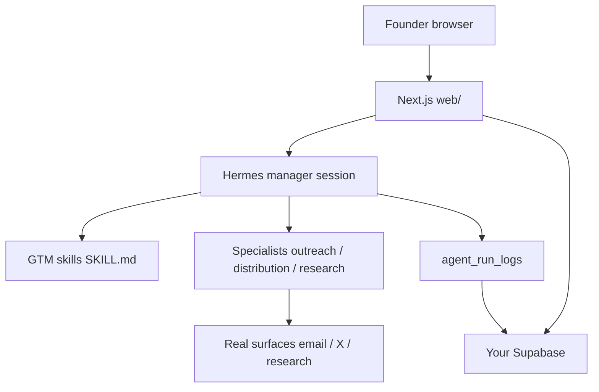

<p align="center">
  
</p>

# Kami

**Your AI go-to-market agency for early-stage startups.**

Community Edition — self-hosted, BYOK. Clone → add your keys → run Hermes locally → open `localhost:3000`.

Tell Kami what you built. It helps you **find customers** and **create distribution** — with real research, reviewed drafts, and no invented emails.

## What it does

1. Enter your domain → confirm the dossier (**That’s us**)
2. Choose **Find customers** (Sales) or **Create distribution** (Marketing)
3. Approve small batches before anything sends or posts
4. Ask Kami anytime — grounded in your live campaign state

## Agent architecture

Kami is not a thin LLM chat UI. **Hermes** is the agent backend; Kami is the founder shell + skills + persistence.



| Layer | Role |
|-------|------|
| **Web app** | Domain → dossier → Sales / Marketing UI, approvals, kill switch |
| **Hermes gateway** | Orchestrator + specialists via OpenAI-compatible API (`:8642`) |
| **Skills** | Inspectable playbooks synced into Hermes (`npm run sync:skills`) |
| **Supabase** | Your project — sessions, campaigns, contacts, opportunities, logs |
| **Optional** | Linkup/Exa/Tavily, AgentMail, X OAuth, browser CDP |

## Requirements

| Need | Required? |
|------|-------------|
| Node.js 20+ / npm | Yes |
| [Hermes Agent](https://hermes-agent.nousresearch.com/docs/) + model key | Yes |
| Your own Supabase project + migrations `001`–`010` | Yes |
| Research provider / AgentMail / X / browser CDP | Optional (graceful degrade) |

## Quick start

```powershell
git clone https://github.com/saranambiar/kami.git
cd kami
cd web
npm install
copy .env.example .env.local
# Fill HERMES_* + Supabase keys; apply web/supabase/migrations/001–010
cd ..
npm run sync:skills
# Start Hermes gateway on 127.0.0.1:8642 (see SETUP.md)
npm run readiness
cd web
npm run dev
```

Open http://localhost:3000. Full steps: **[SETUP.md](SETUP.md)**.

### One-shot agent prompt

Paste into Cursor / Claude / Codex (replace the clone URL):

```text
Set up Kami Community Edition from scratch.

1) Clone https://github.com/saranambiar/kami.git and open the repo.
2) Install Hermes if missing; enable API server on 127.0.0.1:8642 with my model key.
3) Help me create/configure a Supabase project and apply migrations 001–010 (skip 006 if absent).
4) Write only safe local env files from .env.example — never print or commit secrets.
5) npm install in web/, npm run sync:skills, npm run readiness, start Hermes + npm run dev.
6) Tell me what /api/capabilities unlocks and the first click path (domain → dossier).

Ask before writing secrets, applying SQL, or calling external providers.
```

Already cloned? Use the shorter prompt in [docs/community-edition.md](docs/community-edition.md).

## Docs

| Doc | Purpose |
|-----|---------|
| [SETUP.md](SETUP.md) | Minimal local setup |
| [CONTRIBUTING.md](CONTRIBUTING.md) | How to contribute + roadmap |
| [docs/product-loops.md](docs/product-loops.md) | Product / UX contract |
| [docs/community-edition.md](docs/community-edition.md) | BYOK + agent prompts |
| [SECURITY.md](SECURITY.md) | Secrets & privacy |
| [LICENSE](LICENSE) | MIT |

## License

MIT — see [LICENSE](LICENSE).
