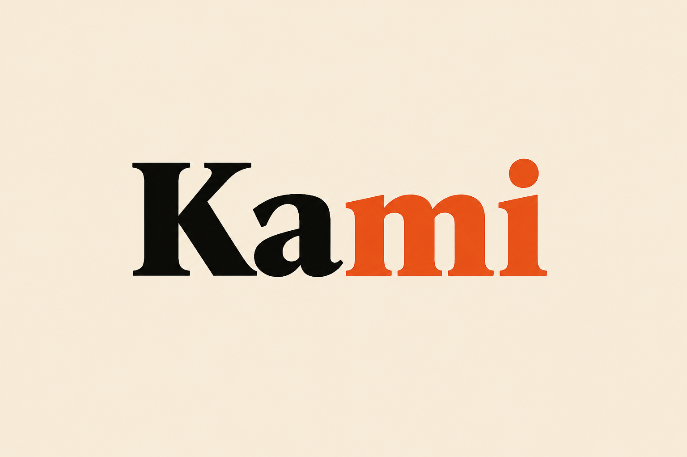

<p align="center">
  
</p>

<h1 align="center">Kami</h1>

<p align="center">
  <strong>Your AI go-to-market agency for early-stage startups.</strong>
</p>

<p align="center">
  Community Edition — self-hosted, BYOK. Run Hermes locally, open <code>localhost:3000</code>.
</p>

Tell Kami what you built. It helps you **find customers** and **create distribution** — with real research, reviewed drafts, and no invented emails.

## What it does

1. Enter your domain → confirm the dossier (**That’s us**)
2. Choose **Find customers** (Sales) or **Create distribution** (Marketing)
3. Approve small batches before anything sends or posts
4. Ask Kami anytime — grounded in your live campaign state

## Requirements

| Requirement | Notes |
|-------------|--------|
| **Node.js 20+** and npm | Required for `web/` |
| **Git** | Clone the repo |
| **[Hermes Agent](https://hermes-agent.nousresearch.com/docs/)** | Local gateway on `127.0.0.1:8642` |
| **Model API key** | For Hermes (OpenAI, OpenRouter, etc.) |
| **Supabase project** | Your own; apply migrations `001`–`010` (skip `006` if absent) |
| Research provider (Linkup / Exa / Tavily) | Optional |
| AgentMail | Optional — drafts work without send |
| X OAuth app | Optional — Post to X when connected |
| Chrome CDP | Optional — browser research |

Kami is **not** a hosted SaaS in Community Edition. You run Hermes + the Next.js app on your machine.

## Quick start

Full detail: **[SETUP.md](SETUP.md)**.

1. **Clone**
   ```powershell
   git clone https://github.com/saranambiar/kami.git
   cd kami
   ```

2. **Install web deps**
   ```powershell
   cd web
   npm install
   ```

3. **Configure Hermes** — install Hermes if needed; copy [`.env.example`](.env.example) into Hermes home (`%LOCALAPPDATA%\hermes\.env` on Windows, `~/.hermes/.env` on macOS/Linux). Set your model key, `API_SERVER_ENABLED=true`, port **8642**, and a long `API_SERVER_KEY`.

4. **Configure the web app** — copy env and fill Hermes + Supabase:
   ```powershell
   copy .env.example .env.local
   ```
   Required keys are listed in [SETUP.md](SETUP.md) § Environment.

5. **Apply Supabase migrations** — run `web/supabase/migrations/001`–`005`, then `007`–`010` in order (skip `006` if missing). See [SETUP.md](SETUP.md) § Database.

6. **Sync skills + readiness** (repo root):
   ```powershell
   cd ..
   npm run sync:skills
   npm run readiness
   ```

7. **Start Hermes** (terminal A) — gateway with API server on `:8642` (see SETUP.md).

8. **Start the app** (terminal B):
   ```powershell
   cd web
   npm run dev
   ```

9. Open **http://localhost:3000** → enter your domain → confirm dossier → Find customers or Create distribution.

### Agent setup prompt

Paste into Cursor / Claude / Codex (full version also in [docs/community-edition.md](docs/community-edition.md)):

```text
Set up Kami Community Edition on this machine end-to-end.

Product: self-hosted BYOK GTM app. Hermes is the agent backend (gateway :8642). Next.js UI is in web/. Clone https://github.com/saranambiar/kami.git (branch main) and open it as the workspace.

Read first: README.md, SETUP.md, docs/community-edition.md, web/.env.example, root .env.example.

Do:
1) Install Hermes if missing. Enable API server on 127.0.0.1:8642. Windows Hermes home = %LOCALAPPDATA%\hermes (not ~/.hermes). Ask me for the model key and API_SERVER_KEY; never print or commit secrets.
2) Create or connect my Supabase project. Apply migrations in web/supabase/migrations/ in order: 001–005, 007–010 (skip 006 if absent). Confirm before running SQL.
3) Write web/.env.local with HERMES_GATEWAY_URL=http://127.0.0.1:8642/v1/chat/completions, HERMES_API_KEY matching API_SERVER_KEY, NEXT_PUBLIC_SUPABASE_URL, SUPABASE_SERVICE_ROLE_KEY. Leave AgentMail, X, Linkup/Exa/Tavily, CDP unset unless I provide them.
4) npm install in web/. From repo root: npm run sync:skills && npm run readiness.
5) Start Hermes gateway, then npm run dev in web/ (prefer next dev --webpack if Turbopack fails on Windows/WSL).
6) Verify GET http://localhost:3000/api/capabilities has hermes + database (+ modelConfigured when possible). Fix blockers until true.
7) Report what is unlocked vs optional, and the first click path: domain → That’s us → Find customers or Create distribution.

Rules: Community Edition is local only — do not require trykami.app. Never invent emails, auto-send, or publish. Ask before writing config, applying SQL, CDP, or external APIs.
```

## Docs

| Doc | Purpose |
|-----|---------|
| [SETUP.md](SETUP.md) | Full local setup |
| [docs/architecture.md](docs/architecture.md) | Hermes agent orchestration & decisions |
| [CONTRIBUTING.md](CONTRIBUTING.md) | PRs, branches (`dev` base), roadmap |
| [docs/product-loops.md](docs/product-loops.md) | Product / UX contract |
| [docs/community-edition.md](docs/community-edition.md) | BYOK detail + agent prompts |
| [SECURITY.md](SECURITY.md) | Secrets & privacy |
| [LICENSE](LICENSE) | MIT |

## License

MIT — see [LICENSE](LICENSE).
