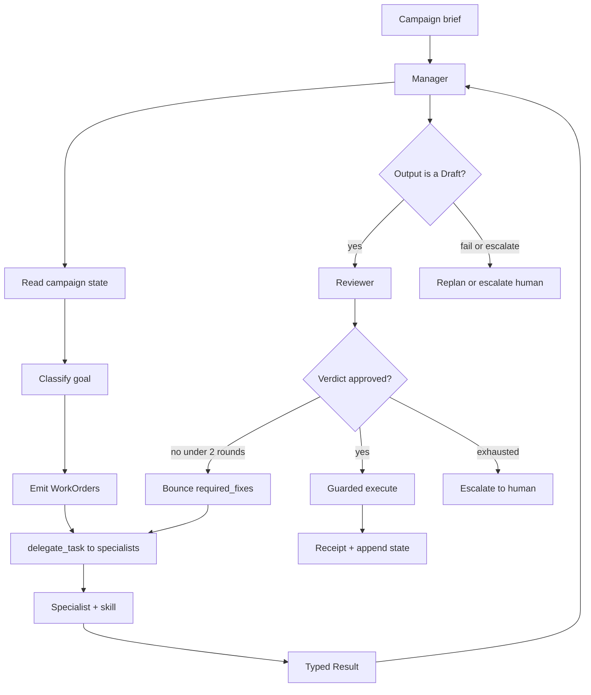

# Architecture — Hermes agents as the harness

This document explains **how Kami’s Hermes agents are orchestrated and make decisions**. Hermes (Nous Research) is the agent runtime. Kami does not invent a second multi-agent framework.

Founder UX loops (domain → Sales / Marketing screens) live in [product-loops.md](product-loops.md). How to run locally: [SETUP.md](../SETUP.md).

---

## 1. Mental model

| Layer | What it is |
|-------|------------|
| **Hermes** | Process that runs agents, tools, skills, and sessions |
| **Manager** | Orchestrator agent — plans, delegates, reviews, gates send. Never does domain work itself |
| **Specialists** | Isolated subagents — research, draft, score, triage. Never talk to each other |
| **Skills** | Versioned playbooks (`skills/*/SKILL.md`) that tell agents *how* to decide |
| **Contracts** | Typed JSON handoffs (`WorkOrder`, `Result`, `Draft`, `Verdict`, `Receipt`) |
| **State** | Campaign memory agents read before planning and append after every hop |

Decisions flow through the **Manager**. Specialists execute one Work Order at a time and return a typed Result.

---

## 2. The decision loop



From [`agents/manager.md`](../agents/manager.md) and [`skills/planning/SKILL.md`](../skills/planning/SKILL.md):

1. **Read state** (`state/campaign.json`) before planning — do not re-contact people already logged.
2. **Classify** the brief goal: `book_meetings | drive_signups | press | awareness`.
3. **Plan** an ordered list of typed `WorkOrder`s. Different goals must produce visibly different plans.
4. **Delegate** each Work Order with Hermes `delegate_task`, passing the Work Order JSON as task context. Independent orders run in parallel; dependent ones wait on `depends_on`.
5. **On each Result**
   - `failed` / `escalate` → replan or escalate to the human with a structured error.
   - Draft-shaped output → send the `Draft` to the **Reviewer**.
6. **Review loop** — on `Verdict.approved: false`, bounce **once** to the drafting specialist with concrete `required_fixes`. Cap at **2** review rounds, then escalate.
7. **Guarded execute** — real send/post only after Reviewer approval **and** email verification `valid` / `safe_to_send` **and** suppression / do-not-contact checks. Log a `Receipt` with `provider_message_id` (HTTP 200 alone is not proof).
8. **Persist** WorkOrders, Results, Drafts, Verdicts, Receipts to state after every hop.

### Hard rules (non-negotiable)

- Specialists **never** talk to each other — every hop routes through the Manager.
- Handoffs are **typed objects**, never prose summaries.
- Empty specialist output = `failed`.
- Loop guard: same `(agent, action, intent)` twice → stop and escalate.
- Enforce Work Order `budget` (`max_tokens`, `max_tool_calls`).
- Manager never calls research, draft, or send tools itself.

---

## 3. Cast of agents — who decides what

Role prompts live in [`agents/`](../agents/). Each file is a contract: what the agent decides, what tools it may use, what it must never do.

| Agent | Decides / does | Must never |
|-------|----------------|------------|
| **Manager** | Goal classification, WorkOrder plan, who gets which task, review bounce, send gate | Domain tools (research, draft, send) |
| **Research** | Prospects + signals for a Work Order | Draft or send |
| **Outreach** | Apply a playbook skill → `Draft` | Send |
| **Reviewer** | Checklist → `Verdict` (no tools) | Rubber-stamp; call tools |
| **Sales strategist** | Campaign → `SalesPlan` | Discovery or send |
| **Sales researcher** | Accounts, contacts, signals | Score, draft, send |
| **Sales qualifier** | Scores / buying groups | Draft or send |
| **Sales conversation manager** | Reply triage / escalate | Direct send outside policy |
| **Sales meeting coordinator** | Calendar after qualify | Invent meetings without provider receipt |
| **Marketing strategist** | Angle + platform plan | Publish or DM |
| **Marketing researcher** | Advanced CRM discovery (later / Advanced) | Default founder Marketing path |
| **Conversation / boost** | Advanced DM / ads specialists | Default Community Edition journey |

---

## 4. Skills — how decisions get made

Skills are step-by-step playbooks. Sync into Hermes with:

```powershell
npm run sync:skills
```

That copies repo `skills/<name>/` → Hermes home `skills/gtm/<name>/` (Windows: `%LOCALAPPDATA%\hermes\skills\gtm`).

| Cluster | Skills | Used when |
|---------|--------|-----------|
| **Manager / policy** | `planning`, `business_rules`, `suppression_and_consent`, `review_rubric`, `sales_review_rubric` | Plan, gates, review checklists |
| **Sales** | `sales_strategy`, `icp_segmentation`, `icp_account_tiering`, `signal_research`, `signal_cold_email`, `email_sequence`, `reply_triage`, `meeting_booking` | Find customers pipeline |
| **Distribution** | `x_distribution`, `reddit_distribution`, `linkedin_distribution`, `hackernews_distribution`, `producthunt_distribution`, `discord_distribution` | Create distribution opportunities |
| **Advanced** | `creator_outreach`, `x_cold_dm`, `persona_mimic` | Later / Advanced paths |

**Contributor rule:** change GTM procedure in `SKILL.md`. Do not invent a parallel agent runtime inside the web app.

---

## 5. Typed handoffs — the language of decisions

Shapes live in [`contracts/contracts.ts`](../contracts/contracts.ts). Every hop passes one of these (by id in state), not a chatty summary.

| Object | Meaning |
|--------|---------|
| `CampaignBrief` | Company, ICP, goal, tone, constraints |
| `WorkOrder` | Who, which playbook, inputs, acceptance criteria, budget, `depends_on` |
| `Result` | `ok` / `needs_input` / `failed` / `escalate` + output + provenance |
| `Draft` | Surface (email / x), body, single CTA, signal ref, self_check |
| `Verdict` | `approved`, failed criteria, **concrete** `required_fixes` |
| `Receipt` | Real proof: `provider_message_id` / live URL |

### Example hop (book meetings)

```text
Manager
  → WorkOrder{ assigned_to: research, playbook: signal_research, … }
Research
  → Result{ status: ok, output: Prospects + Signals }
Manager
  → WorkOrder{ assigned_to: outreach, playbook: signal_cold_email, inputs: prospect_id, … }
Outreach
  → Result{ output: Draft }
Manager
  → Reviewer(Draft)
Reviewer
  → Verdict{ approved: false, required_fixes: ["Cut to ≤150 words", "One CTA only"] }
Manager
  → bounce Outreach once with required_fixes
Outreach
  → Draft'
Reviewer
  → Verdict{ approved: true }
Manager
  → gated send → Receipt → append state
```

---

## 6. Review as a decision system

The Reviewer ([`agents/reviewer.md`](../agents/reviewer.md)) has **no tools**. It walks `review_rubric` / `sales_review_rubric` item by item and emits only a `Verdict`.

| Outcome | Manager action |
|---------|----------------|
| `approved: true` | May proceed to guarded execute (still subject to email/suppression gates) |
| `approved: false` | Bounce drafting specialist once with `required_fixes` |
| Still failing after 2 rounds | Escalate to human — do not keep looping |
| Empty / nonsense draft | Treat as failed Result |

Agent review ≠ human product approval. The Manager still refuses send without verification + suppression checks. In the Community Edition UI, founders also approve batches before real surfaces fire ([product-loops.md](product-loops.md)).

---

## 7. Different briefs → different specialist graphs

The planning skill forces goal-specific plans (examples):

| Goal | Typical specialist sequence |
|------|----------------------------|
| `book_meetings` | Research (prospects) → Outreach (`signal_cold_email`) → Reviewer → gated send |
| `drive_signups` / `awareness` | Distribution / content playbooks (platform `*_distribution` skills) → Reviewer before publish |
| `press` | Manager may spawn a PR-angle specialist with a role prompt written for that brief |

Sales-heavy work uses the sales specialist tree (strategist → researcher → qualifier → conversation / meeting). Marketing distribution uses platform skills and the marketing strategist; Advanced CRM/DM agents stay off the default path.

**Honesty gate:** never invent emails. Role inboxes and unverified addresses are not sendable. PLG/D2C with no B2B accounts should route to distribution playbooks, not fake consumer outreach.

---

## 8. State — memory for the next decision

Subagents are isolated. Cross-hop memory is **explicit**:

1. Manager **reads** campaign state before planning.
2. After every hop, Manager **appends** typed objects (`state/state.py` / `state/campaign.json` in the agency harness).
3. Standing policy lives in skills (`business_rules`, `suppression_and_consent`) — always in force, not one-off chat memory.

If it is not in state or in a skill, the next specialist does not know it.

---

## 9. Running under Hermes

| Concern | Practice |
|---------|----------|
| Gateway | Hermes API server on `127.0.0.1:8642` (see SETUP) |
| Skills | `npm run sync:skills` after playbook edits |
| Nesting | Manager → specialist needs `delegation.max_spawn_depth ≥ 2` when using orchestrator nesting |
| Sessions | `delegate_task` Results return to a **live** parent session — keep the gateway process up; one-shot CLI exits can drop async Results |
| Proof | Persist `Receipt.provider_message_id` (or live post URL), not just a success status code |

---

## 10. How the web shell attaches (secondary)

The Community Edition app (`web/`) is a founder shell: it talks to the Hermes gateway for LLM steps, stores campaign rows in **your** Supabase, and enforces product approval UX. It is **not** a replacement for the Manager decision model above.

- Hermes integration helpers: `web/lib/hermes.ts`, `web/lib/hermesServer.ts`
- Product loops: [product-loops.md](product-loops.md)
- Capability gates (what is unlocked without AgentMail / X / research keys): `GET /api/capabilities`

When improving “how the agency thinks,” prefer `agents/` + `skills/` + `contracts/`. When improving screens and API gates, change `web/`.

---

## 11. Related paths

| Path | Role |
|------|------|
| [`agents/`](../agents/) | Role prompts and boundaries |
| [`skills/`](../skills/) | Decision playbooks |
| [`contracts/contracts.ts`](../contracts/contracts.ts) | Typed handoff shapes |
| [`state/`](../state/) | Campaign state read/append |
| [`SETUP.md`](../SETUP.md) | Run Hermes + web locally |
| [`product-loops.md`](product-loops.md) | Founder UX contract |
| [`AGENTS.md`](../AGENTS.md) | Build / coding-agent intent |

---

## Non-goals

- Do not build a custom agent bridge — use Hermes’s API server.
- Community Edition does not require a hosted Kami cloud.
- Advanced CRM / cold DMs / ads agents are not the default orchestration path.
- Do not treat prose chat between specialists as a valid handoff.
