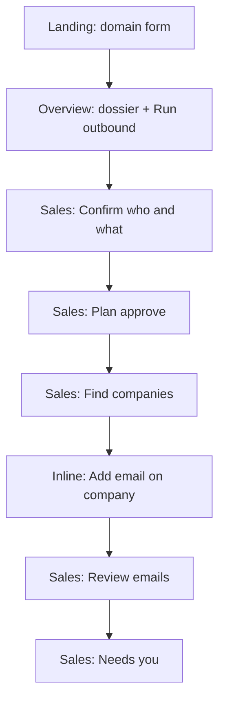

# Kami founder product loops + Sales UI/UX

> Canonical copy of the Cursor plan **Sales founder UX** for review in-repo.
> Source: `.cursor/plans/sales_founder_ux_03e26c92.plan.md` (local Cursor plans folder).

## Todos

- [x] Write `docs/product-loops.md` with locked core product + feature loops; update AGENTS.md, docs/sales/*, memory, E2E test
- [x] Add Run outbound CTA on Overview; route into Sales with dossier prefill
- [x] Replace SalesSetup with NL-A confirm screen (who/what/how many) + Advanced; full-width roomy fields
- [x] Progressive Sales steps: plan → find → review emails → needs you; demote extra tabs
- [x] UI to add contact email / test inbox; create-sequence button; hybrid send (1–3 then batch)
- [x] Full-width Sales layout, textarea styles, plain-English plan/ops copy

---

## Execution instructions — Composer

Assign this entire build to **Composer**. It owns docs-first delivery, UI implementation, wiring of existing Sales APIs, focused verification, and staying aligned with locked product loops.

### Before any code

1. Read [docs/product-loops.md](../product-loops.md) once it exists (Phase 0 writes it first). Until then, treat the **Locked decisions** and **Core product loop** sections in this plan as law.
2. Read [DESIGN.md](../../DESIGN.md) and reuse existing Sales/Marketing patterns — do not invent a new visual system.
3. Skim [docs/sales/](../sales/) only for the files you are changing; do not rescan the whole repo every turn.
4. Prefer [memory/sales-vertical.md](../../memory/sales-vertical.md) + [tasks/todo.md](../../tasks/todo.md) for reorientation.

### Non-negotiable product rules (do not “improve” away)

- Domain-first → recommend → confirm → act → escalate. Never reintroduce a blank SDR jargon form as the default Sales entry.
- One primary Hanko-red CTA per screen; progressive disclosure (Find → Review emails → Needs you). Do not show six equal ops tabs on first run.
- Prefill Sales from Overview dossier; NL-A sentences + optional Edit details + Advanced collapsed.
- Never invent contact emails. Block send until an email exists; provide Add email / test inbox UI.
- Discovery starts only on explicit **Find companies** click after plan approve.
- Hybrid send: first 1–3 individual, then optional batch for remaining approved drafts.
- Marketing tab is out of scope — do not refactor Marketing except if Dashboard wiring requires a minimal touch for Run outbound.

### Implementation order (strict)

1. Docs (`docs/product-loops.md` + AGENTS.md + Sales docs sync)
2. Overview **Run outbound** + dossier pass-through
3. NL confirm + layout/CSS
4. Plan copy + stepper / hide extra tabs
5. Find + add email + sequence create wired in UI
6. Drafts hybrid send + Needs you
7. E2E test guide rewrite

Mark plan todos complete as you go. Do not skip Phase 0 docs.

### Token-efficient Composer habits

- Work one phase at a time; keep context to that phase’s files + interfaces.
- Reuse existing APIs: `/api/sales/setup`, `plan`, `discover`, `accounts`, `sequences`, `drafts`, `inbox`, `meetings` — wire UI before adding new endpoints. Only add a small contact upsert if missing.
- Ask for short verification: files changed, acceptance check, blockers. Avoid dumping full files into chat.
- Batch reads; run typecheck/`npm run eval:sales` after a coherent slice, not after every tiny edit.
- Summarize phase decisions into `memory/sales-vertical.md` instead of re-reading long transcripts.

### Runtime / escalation

- If a finite command (install, tsc, build, migrate) shows no progress for ~3–4 minutes: inspect, stop if hung, find root cause, do not retry blindly.
- Stop and notify the user when credentials, real outbound send, destructive data ops, or architecture tradeoffs need a human decision. Report evidence, likely cause, impact, and the smallest ask.

### Done means

A founder can: domain → Overview → Run outbound → confirm NL → approve plan → Find companies → add email → review/send (hybrid) → see Needs you — without console hacks or ICP jargon. Docs and AGENTS.md reflect this so future agents do not drift.

---

## Locked decisions (from ideation)

- Target user: founders who want sales automated; may know basic GTM terms.
- Philosophy: domain-first → recommend → confirm → act → escalate (never blank SDR brief).
- Sales setup: **B** prefill + confirm; **NL-A** (natural-language sentences + optional Edit details).
- Entry: Overview CTA **Run outbound** + Sales tab as ops home.
- After NL confirm → show/generate plain-English plan → Approve.
- Discovery: explicit **Find companies** click (not auto).
- Contacts: never invent emails; block send until email exists; easy **Add email** / test inbox.
- Send: **hybrid** — first 1–3 one-by-one, then “Send rest of approved.”
- Ops: progressive disclosure — Find → Review emails → Needs you first; Pipeline/Meetings/Tasks after first send or under More.
- Scope: Domain → Overview → Sales only; Marketing later.
- Competitor lessons: Okara domain+feed (don’t copy 10 agents day one); Origami NL ICP (copy); Fastlane “meetings” outcome language (copy promise, stay self-serve).

---

## Phase 0 — Docs first (must land before UI code)

Write [docs/product-loops.md](../product-loops.md) as the source of truth for product + feature loops (content sketched below). Then sync:

- [AGENTS.md](../../AGENTS.md) — add short “Product UX principles” (domain-first, one job per screen, recommend→confirm→act, Sales consumes Overview dossier).
- [docs/sales/README.md](../sales/README.md) + [requirements.md](../sales/requirements.md) + [ui-information-architecture.md](../sales/ui-information-architecture.md) — align journey to locked loops.
- [memory/sales-vertical.md](../../memory/sales-vertical.md) + [tests/sales-end-to-end-test.md](../../tests/sales-end-to-end-test.md).

### Core product loop (canonical)

```text
1. START      Domain + goals + stage
2. UNDERSTAND Overview dossier
3. CHOOSE     Run outbound → Sales
4. CONFIRM    NL: who / what / how many (prefilled)
5. PLAN       Plain-English next steps → Approve
6. FIND       Companies + why → Include/exclude → Continue
7. CONTACT    Ensure email on included companies (add / test inbox)
8. DRAFT      Emails appear
9. SEND       Hybrid review/send
10. WATCH     Needs you (replies, meetings)
```

### Feature loops (canonical)

| Loop | Trigger | User | Kami | Success feel |
|------|---------|------|------|----------------|
| Understand | Domain submit | Wait / skim | Linkup + Hermes dossier | “That’s us” |
| Enter Sales | Run outbound | Click CTA | Prefill from dossier | “Not a blank form” |
| Confirm | NL screen | Edit sentences / Continue | Map NL → SalesCampaignConfig | “I steered who/what” |
| Plan | After confirm | Approve | Synthesize plan (plain English) | “I know what happens next” |
| Find | Find companies | Include/exclude | Discover + scores + sources | “I know why these” |
| Contact | Before draft/send | Add email if missing | Persist sales_contacts | “We can actually email someone” |
| Draft | After include + email | Open Review emails | Sequences + touchpoints | “Drafts ready” |
| Trust send | Drafts ready | Review 1–3, then batch | Reviewer + AgentMail + receipt | Real send |
| Convert | Reply / meeting | Decide | Classify, escalate, calendar | Meeting path |
| Safety | Anytime | Kill switch / Advanced | Pause, DNC, caps | No surprises |

---

## User flow + UI/UX (screen by screen)

### Visual system (keep)

Keep [DESIGN.md](../../DESIGN.md): cream paper, ink, Hanko-red **one primary CTA per screen**, kraft cards, Domine / Source Sans 3 / Space Mono, sharp edges. Fix density/width — don’t invent a new brand.

### Screen map



### 1. Landing (mostly keep)

**Job:** Start with one thing they know.  
**Visuals:** Existing hero + domain + goal/stage chips.  
**Change:** None required for this pass (optional: helper “We’ll research your company and suggest who to sell to”).

### 2. Overview (change: primary path into Sales)

**Job:** Prove Kami understood the company; offer one clear next step for sales.  
**Current:** 3-col grid (channels | activity/approvals/chat | intel); Sales is a separate tab with no bridge.  
**Change:**
- Add Hanko CTA **Run outbound** (near opportunities or dossier header) → switches to Sales tab with dossier context.
- Optional: mark sales-flavored opportunity cards with secondary “Run outbound for this.”
- Keep activity feed + dossier; do not add Sales form here.

### 3. Sales — Confirm who & what (replace blank setup)

**Job:** Confirm prefilled NL; not invent ICP.  
**Current:** Narrow 640px jargon form (offer, ICP, exclusions, deal range, autonomy…).  
**New visuals:**
- Full width of `container-wide`.
- Short intro: “We filled this from your company research. Edit anything that looks wrong.”
- 3 large NL blocks (textarea, ~120px+):
  1. “Who should we try to book meetings with?”
  2. “What should we say you help with?”
  3. “How many companies should we research first?” (chips: 10 / 15 / 25)
- Link **Edit details** → optional structured fields (titles, industries, geo).
- Collapsed **Advanced**: exclusions, daily cap, deal range, sender, auto follow-ups.
- One CTA: **Looks good — show plan**.

### 4. Sales — Plan (simplify copy + focus)

**Job:** Approve what Kami will do next.  
**Current:** Motion IDs like `signal_outreach`, dense tiers, then 6 ops tabs visible.  
**Change:**
- Intro line + plain-English motions.
- Hide ops tabs until plan approved (or show disabled stepper: Confirm ✓ → Plan → Find → Emails → Needs you).
- CTA: **Approve plan**.

### 5. Sales — Find companies

**Job:** Pick who to pursue.  
**Current:** Targets tab with Run discovery; all tabs equal; no contact email UX.  
**Change:**
- Stepper step “Find companies”; primary CTA **Find companies** after approve (not auto).
- Full-width company cards: name, why (signal + source link), score as plain “Fit / Timing” not opaque jargon.
- Include checkboxes; CTA **Continue with selected**.
- If no email on a selected company: inline **Add email** (or “Use my email for a test send”) before Continue can finish.

### 6. Sales — Review emails

**Job:** Trust gate for send.  
**Current:** Drafts tab; sequence creation only via console API.  
**Change:**
- After Continue: auto-create sequences for selected companies **with emails** (wire UI to existing `/api/sales/sequences`).
- Draft cards: subject, body preview, recipient, Review → Approve → Send.
- Hybrid: after 1–3 successful individual sends, show **Send remaining approved**.
- Empty state if no emails: “Add a contact email on Find companies first.”

### 7. Sales — Needs you

**Job:** Only what needs a human.  
**Current:** Inbox + Meetings + Tasks as separate equal tabs.  
**Change:**
- Single **Needs you** surface combining notifications, reply decisions, meeting proposes.
- Pipeline / full Inbox / Meetings / Tasks under **More** after first send (or always available but not default).

### 8. Global Sales chrome

- Kill switch stays top-right (safety).
- Stepper or progress: `Confirm → Plan → Find → Emails → Needs you`.
- Settings gear opens Advanced / re-edit NL confirm.
- Remove 640px centering; roomier textareas in CSS.

---

## What must change vs current code (summary)

| Area | Current | Target |
|------|---------|--------|
| `web/components/SalesSetup.tsx` | Dense jargon form, maxWidth 640 | NL-A confirm + Advanced, full width |
| `web/components/SalesPanel.tsx` | Setup → plan + 6 tabs always | Stepper guided path; progressive tabs |
| `web/components/Dashboard.tsx` / Overview | No Run outbound | CTA into Sales with dossier |
| `web/components/SalesPlanView.tsx` | Agent motion IDs | Plain English + intro |
| `web/components/SalesTargetReview.tsx` | Discovery only | + Add email; Continue wires sequences |
| `web/components/SalesDraftQueue.tsx` | Manual/no sequence CTA | Auto after find; hybrid send |
| New Needs-you view | Split Inbox/Meetings/Tasks | Combined first-run surface |
| `web/app/globals.css` | No textarea style; tight forms | Sales full-width + roomy textareas |
| APIs | Sequences/contacts exist but UI-gapped | Wire UI; optional small API for contact upsert |

---

## Implementation order

1. **Docs** — `docs/product-loops.md` + AGENTS.md + Sales docs sync (no UI yet).
2. **Overview Run outbound** + dossier pass-through.
3. **NL confirm + layout/CSS**.
4. **Plan copy + stepper / hide extra tabs**.
5. **Find + add email + sequence create**.
6. **Drafts hybrid send + Needs you**.
7. **E2E test guide rewrite** to match new flow.

## Out of scope

- Marketing tab redesign.
- Full contact enrichment provider (Apollo/Clay) — manual/test email is enough for loop closure.
- Pure chat setup (NL-B).

## Acceptance

- Founder can go domain → Overview → Run outbound → confirm NL → approve plan → find → add email → review → send without jargon or console hacks.
- One primary Hanko CTA per Sales step; no six equal tabs on first run.
- Product loops documented and referenced in AGENTS.md so future work does not reintroduce blank SDR forms.
