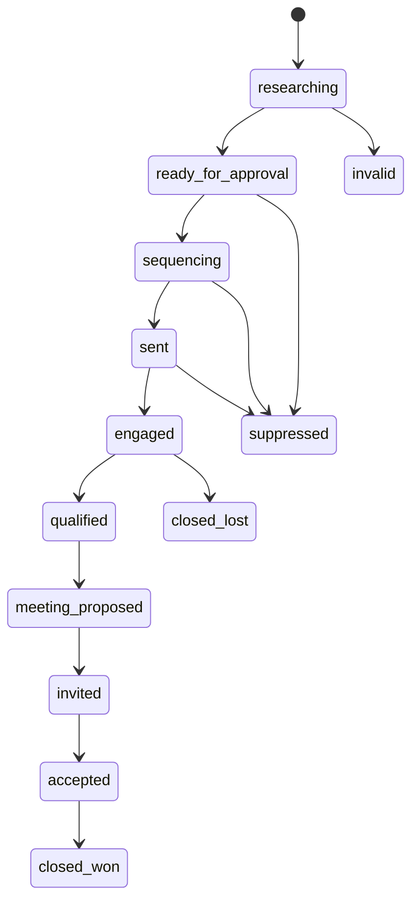

# Sales Data Model and State Machines

## Scope and ownership

Every record is scoped to `workspace_id`, `client_id`, and `sales_campaign_id`. Hermes session IDs are execution correlation identifiers, not tenancy keys.

Use immutable evidence, receipt, message, and audit-event records with current-state projections for pipeline displays. This makes every score, send, state change, and automation decision explainable.

## Core entities

- `workspaces`, `clients`, `provider_accounts`
- `sales_campaigns`, `sales_plans`, `approval_policies`, `approvals`
- `accounts`, `account_signals`, `contacts`, `buying_group_members`, `lead_scores`
- `sequences`, `sequence_enrollments`, `touchpoints`
- `conversations`, `conversation_messages`, `reply_classifications`
- `meetings`, `tasks`, `notifications`
- `suppression_entries`, `execution_receipts`, `agent_runs`, `audit_events`

## Key constraints

- Contact uniqueness is scoped by workspace/client and normalized channel identity, not globally by platform handle.
- Signals have provider, URL, observed/captured timestamps, confidence, and evidence text.
- A score stores its scoring model version, factor values, explanation, and evidence references.
- A touchpoint is immutable and references a sequence enrollment, message/draft, provider receipt, and channel.
- A suppression entry is channel-aware and records reason, source, timestamp, scope, and actor.

## Pipeline state machine

Permitted transitions are validated by server code, not by a free-form agent update.

## Sequence enrollment state

- `draft`, `awaiting_approval`, `eligible`, `sent_step_1`, `waiting`, `sent_step_2`, `completed`
- Terminal: `replied`, `bounced`, `unsubscribed`, `suppressed`, `meeting_created`, `cancelled`

## Meeting state

- `proposed`, `held`, `invited`, `accepted`, `declined`, `rescheduled`, `cancelled`, `no_show`, `completed`

Only a provider-backed event/invitation can transition an item to `invited`; only an attendee/provider result can transition it to `accepted`.
